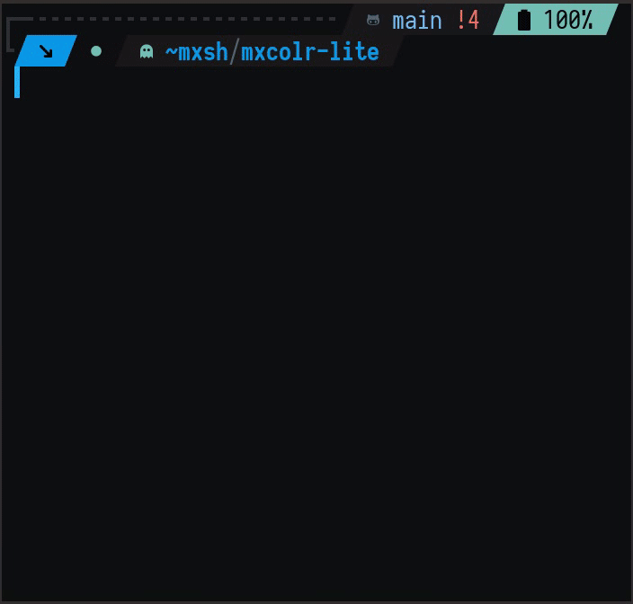

# mxcolr-lite ꚙ

Usage
=====
    mxcolr-lite

### every file in `./templates/{tpl}` will be parsed; 
### scheme variables replaced; and placed in `./out/{tpl}`

Requirements
------------
- [pastel](https://github.com/sharkdp/pastel)
- [GNU bc](https://www.gnu.org/software/bc)

## this project is the lite version of [mxcolr](https://github.com/metaory/mxcolr)
